# Финальный проект

# SF-AdTech Tracker

SF-AdTech Tracker — веб-приложение для управления рекламными офферами и партнерской системой между рекламодателями и вебмастерами.

---

## Используемые технологии

* PHP 8.5.4
* Laravel 13.15.0
* Laravel Breeze
* Blade
* Tailwind CSS
* JS
* Vite
* MySQL 9.7.0
* Laravel Reverb
* Laravel Echo
* WebSocket
* PHPUnit
* Monolog
* Docker

---

# Основные возможности

## Администратор

* вход в систему;
* изменение комиссии системы;
* управление пользователями (создание, редактирование, блокировка, разблокировка, удаление, восстановление с офферами/подписками);
* активация/деактивация офферов через Drag&Drop;
* удаление неактивных офферов;
* изменение списка доступных офферов в режиме реального времени;
* отображение количества подписчиков в режиме реального времени;
* просмотр статистики системы.

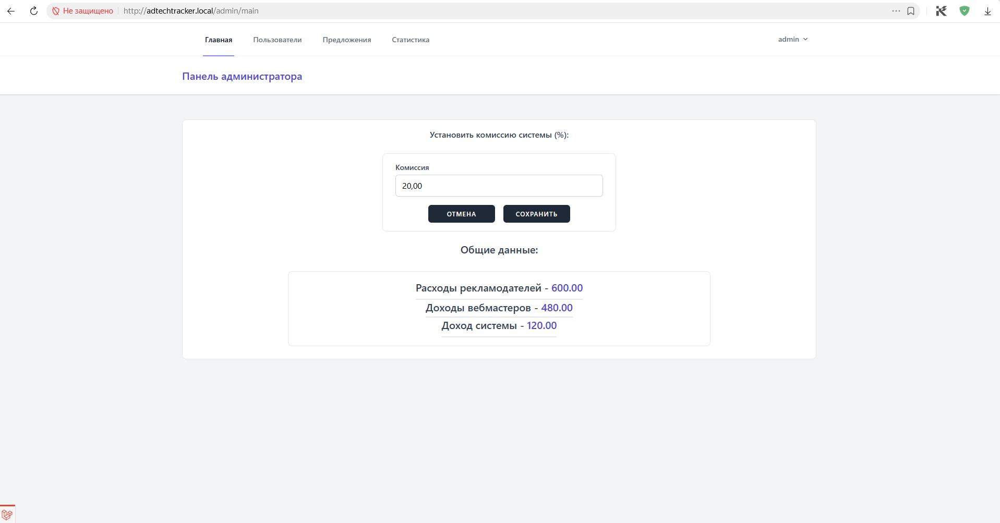
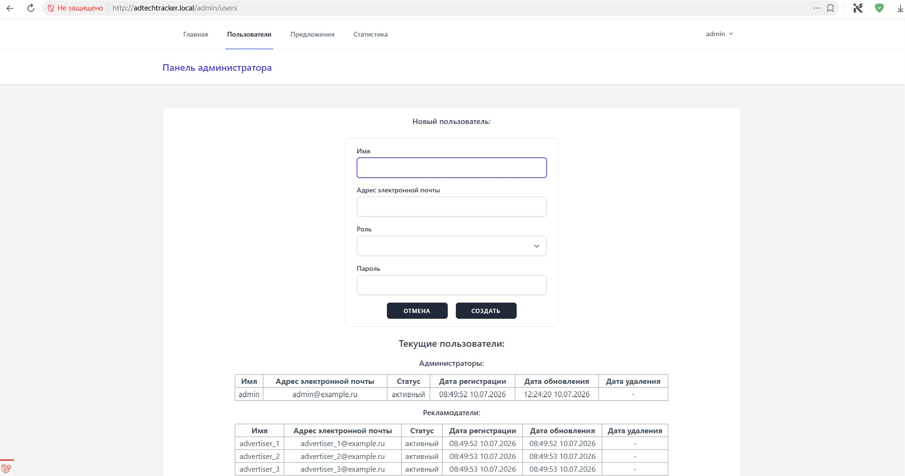
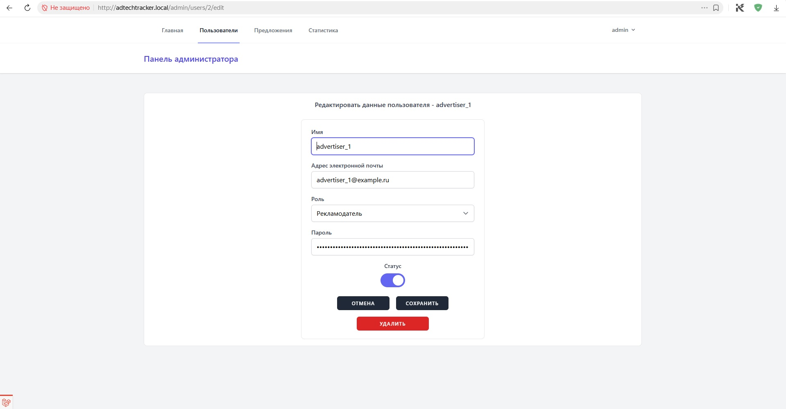
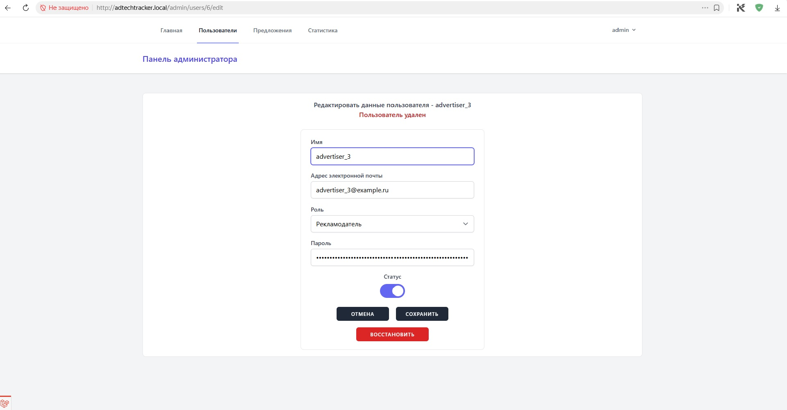
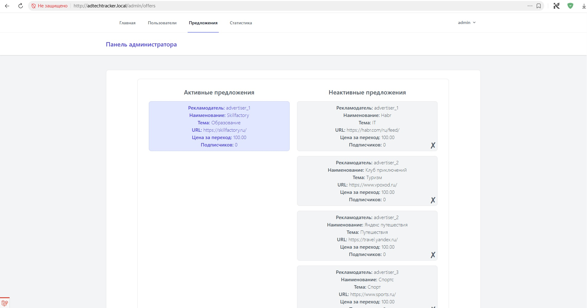
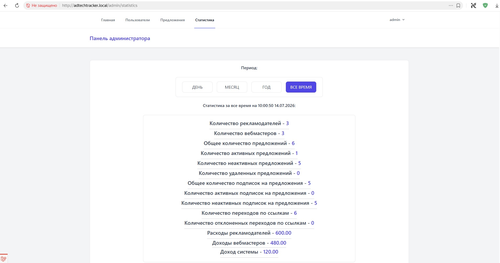

## Рекламодатель

* регистрация и вход в систему;
* создание тематики офферов;
* создание офферов (имя, URL, цена за переход, тематика);
* просмотр своих офферов;
* редактирование неактивных офферов;
* удаление неактивных офферов;
* восстановление офферов с подписками;
* активация/деактивация офферов через Drag&Drop;
* изменение списка доступных офферов в режиме реального времени;
* отображение количества подписчиков в режиме реального времени;
* просмотр статистики по расходам и переходам.

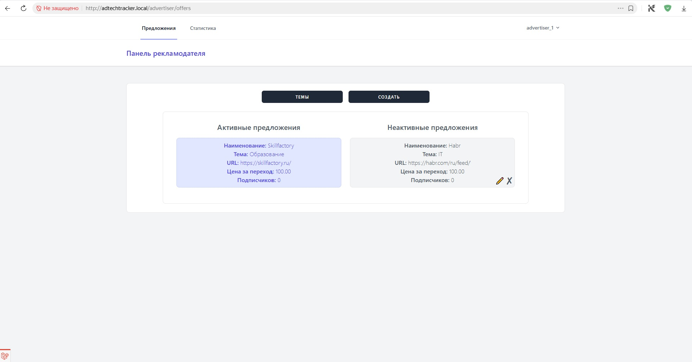
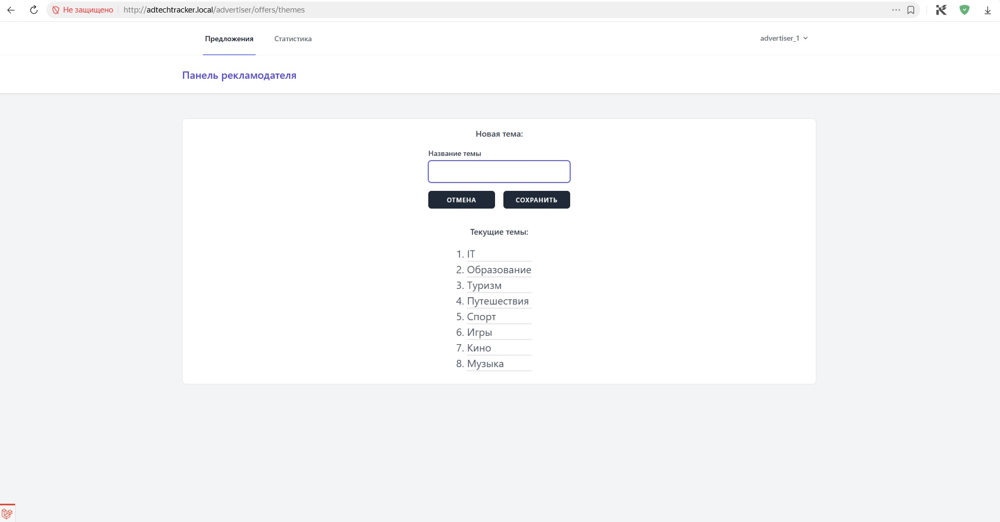
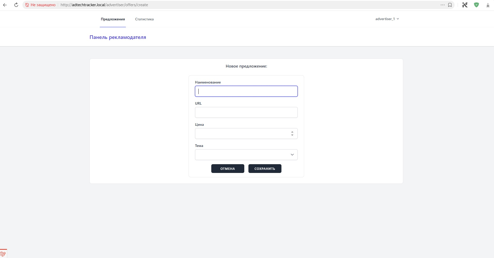
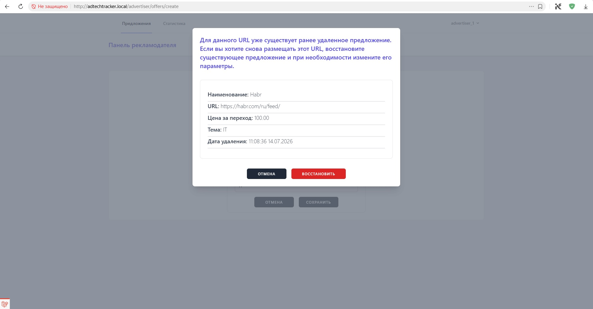
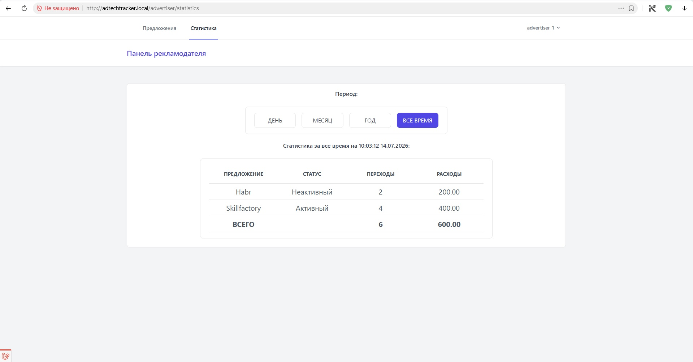

## Вебмастер

* регистрация и вход в систему;
* просмотр своих подписок;
* подписка на офферы через Drag&Drop;
* отписка от офферов через Drag&Drop;
* получение индивидуальной реферальной ссылки;
* изменение списка доступных офферов в режиме реального времени;
* просмотр статистики по доходам и переходам.

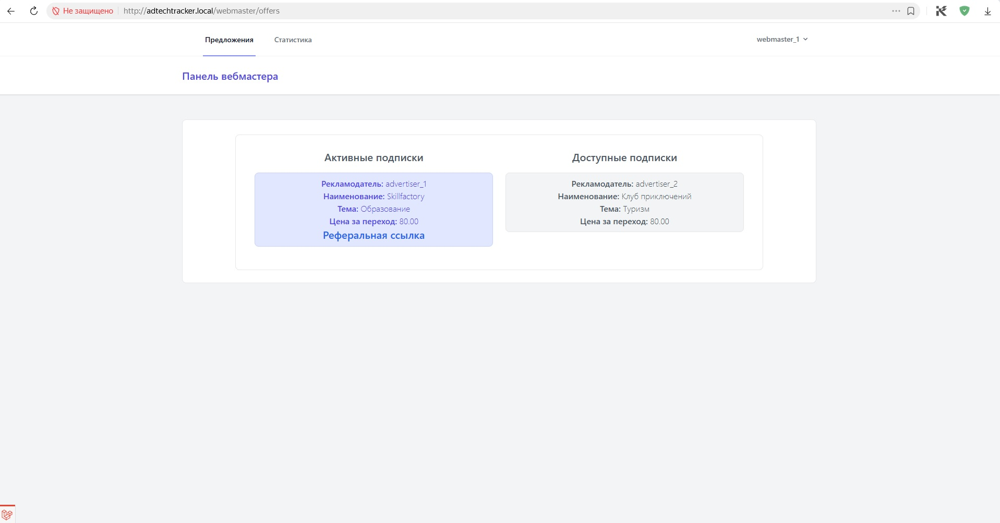
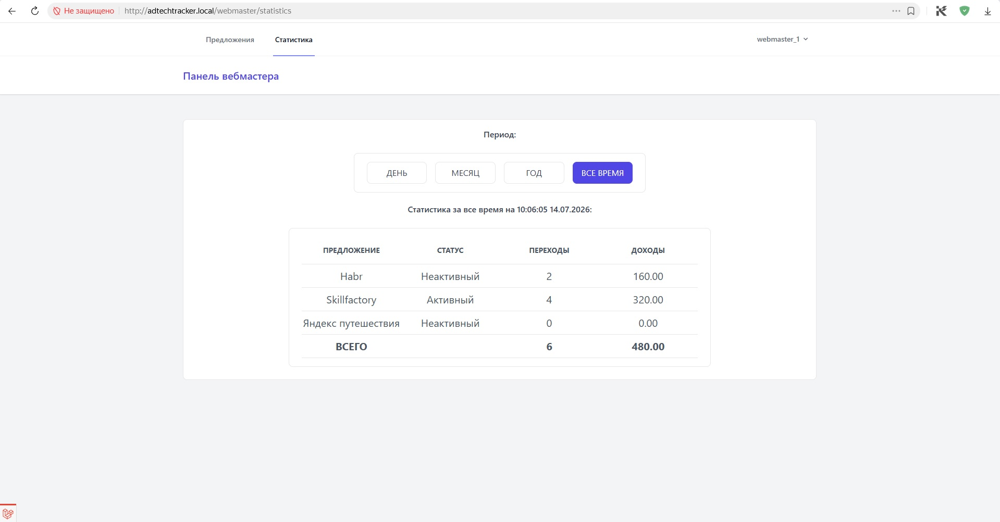

---

## Реализованный функционал

* ролевая модель доступа (Администратор / Рекламодатель / Вебмастер);
* безопасная аутентификация Laravel Breeze;
* подтверждение регистрации через email (с использованием Mailpit);
* восстановление пароля по email (с использованием Mailpit);
* локализация интерфейса (RU / EN);
* редактирование своего профиля пользователем:
  * сохранение выбранного языка;
  * изменение данных профиля;
  * изменение пароля;
  * удаление своей учетной записи;
* администратор может:
  * создать учетную запись пользователя;
  * редактировать учетную запись пользователя;
  * заблокировать/разблокировать пользователя;
  * удалить пользователя;
  * восстановить пользователя, в зависимости от роли, вместе с офферами/подписками;
* уведомление по email (с использованием Mailpit) о блокировке/удалении пользователя;
* каждый пользователь имеет доступ только к своему личному кабинету;
* защита от удаления последнего администратора системы;
* использование SoftDelete для пользователей, офферов и подписок;
* восстановление удаленных офферов вместе с подписками;
* уникальность URL оффера для каждого рекламодателя;
* WebSocket обновление интерфейса без перезагрузки страницы;
* Drag&Drop изменение статуса оффера в режиме реального времени;
* Drag&Drop изменение подписка/отписка на офферы в режиме реального времени;
* обновление офферов у всех подключенных пользователей в режиме реального времени;
* обновление подписок вебмастеров в режиеме реального времени;
* изменение количества подписчиков в режиеме реального времени;
* автоматическая генерация реферальных ссылок;
* переход по реферальной ссылке;
* учет расходов рекламодателя;
* расчет дохода вебмастера;
* расчет комиссии системы;
* проверка возможности перехода вебмастера по ссылке;
* фиксация перехода в журнале переходов;
* фиксация отказов в журнале отклоненных переходов;
* фиксация действий пользователея в журнале безопасности;
* статистика по ролям;
* фильтрация статистики по периодам без перезагрузки страницы:
  * день;
  * месяц;
  * год;
  * весь период;
* с целью сохранения истории и стоимости переходов, для корректного подсчета статистики сознательно допущена денормализация таблицы offer_clicks;
* при выключенном JS выводится предупреждение для пользователя.

---

# Безопасность

В проекте реализованы дополнительные проверки безопасности:

* невозможность удаления последнего администратора;
* валидация всех пользовательских данных;
* проверка уникальности URL оффера;
* проверка активности оффера при переходе;
* проверка активности подписки;
* логирование всех отказов доступа;
* логирование регистрации пользователя;
* логирование входа/выхода пользователя;
* логирование создания/удаления/восстановления пользователя;
* логирование блокировки/разблокировки пользователя;
* логирование изменений данных пользователя;
* логирование попыток доступа на запрещенные страницы.

---

# Тестирование

Проект покрыт Feature и Unit тестами.

Покрываются:

* регистрация и авторизация;
* управление пользователями;
* управление профилем;
* управление офферами;
* изменение статуса офферов;
* подписки вебмастеров;
* восстановление офферов;
* переход по реферальным ссылкам;
* статистика;
* бизнес-правила системы.

Общее покрытие тестами:

**≈ 86%**

Запуск тестов:

```bash
docker compose exec adtechtracker-php php artisan test
```
Получить покрытие тестами:

```bash
docker compose exec adtechtracker-php php artisan test --coverage
```

---

## Тестовые аккаунты

| Роль | Email | Пароль |
|------|-------|--------|
| Администратор | admin@example.ru | 12345678 |
| Рекламодатель 1 | advertiser_1@example.ru | 12345678 |
| Рекламодатель 2 | advertiser_2@example.ru | 12345678 |
| Рекламодатель 3 | advertiser_3@example.ru | 12345678 |
| Вебмастер 1 | webmaster_1@example.ru | 12345678 |
| Вебмастер 2 | webmaster_2@example.ru | 12345678 |
| Вебмастер 3 | webmaster_3@example.ru | 12345678 |

---

## Проект разрабатывался и тестировался

* Ubuntu 24.04 + Docker;
* Windows 10 + Docker Desktop + WSL2 (Ubuntu);
* Windows 10 + Oracle VirtualBox + Ubuntu Server 24.04 + Docker;

Если запускать проект под Windows + Docker Desktop, работать будет, но в связи с особенностями работы WSL2 и большим количеством файлов в Laravel, будут значительные задержки при открытии страниц.

# Развертывание проекта

### Проект построен c использованием docker контейнеров
* PHP
* Nginx
* MySQL
* Redis
* Memcached
* Reverb
* Mailpit
* node
* phpmyadmin
* scheduler
* worker

В данном проекте используются не все контейнеры, сборка сделана как универсальный инструмент для разработки.

### Для развертывания проекта необходимо предварительно установить

* Docker
* Docker Compose

Других зависимостей (PHP, Composer, Node.js, MySQL, Redis и т.д.) на хост-системе не требуется. Пользователь от имени которого осуществляется запуск должен входить в группу docker.

### Запуск

Клонировать репозиторий:
```bash
git clone https://github.com/diorgius/final_project.git
```
Перейти в директорию:
```bash
cd final_project/
```
Создать файлы окружения:
```bash
cp docker/.env.example docker/.env
cp adtechtracker.local/.env.example adtechtracker.local/.env
```
Перейти в директорию:
```bash
cd docker/
```
Запустить контейнеры:
```bash
docker compose up -d --build
```
Установить зависимости Composer:
```bash
docker compose exec adtechtracker-php php composer install
```
Установить зависимости Node.js:
```bash
docker compose run --rm --user "$UID:$(id -g)" adtechtracker-node npm install
```
Сгенерировать ключ приложения:
```bash
docker compose exec adtechtracker-php php artisan key:generate
```
Выполнить миграции и заполнить базу тестовыми данными:
```bash
docker compose exec adtechtracker-php php artisan migrate --seed
```

---

### Либо использовать автоматическую установку:
```bash
cd final_project/docker
./setup.sh
```

---

Добавить в файл hosts запись:
```bash
127.0.0.1 adtechtracker.local
```
Если используется виртуальная машина:
```bash
<VM IP address> adtechtracker.local
```
Перейти на страницу приложения:
```bash
http://adtechtracker.local
```
Для доступа к PhpMyAdmin:
```bash
http://adtechtracker.local:81
```
Для просмотра почтовых сообщений Mailpit перейти по адресу:
```bash
http://adtechtracker.local:8025
```

---
### Если после старта контейнеров, контейнер node завершается с ошибкой:
```bash
ENOSPC: System limit for number of file watchers reached
```
необходимо выполнить:
```bash
echo fs.inotify.max_user_watches=524288 | sudo tee /etc/sysctl.d/99-inotify.conf
echo fs.inotify.max_user_instances=1024 | sudo tee -a /etc/sysctl.d/99-inotify.conf
sudo sysctl --system
```
---

### Полезные команды docker

Остановить контейнеры:
```bash
docker compose down
```
Остановить контейнеры с удалением томов:
```bash
docker compose down -v
```
Пересобрать контейнеры:
```bash
docker compose up -d --build
```
Просмотреть логи приложения:
```bash
docker compose logs -f container_name
```

## Возможные направления развития проекта

### API

Сейчас приложение построено на Blade. В дальнейшем возможно вынести бизнес-логику в REST API и реализовать отдельный SPA-клиент (Vue.js / React).

### Уведомления

Добавить систему уведомлений:
создание нового оффера;
изменение статуса оффера;
получение новых подписчиков;
достижение заданного количества переходов.

### Экспорт статистики

Выгрузка статистики:
Excel;
CSV;
PDF.

### Очереди

Сейчас события работают быстро, но можно вынести некоторые операции в очереди: 
email;
генерация отчетов;
обработка статистики.

### Кабинет администратора

Добавить:
графики доходов;
графики переходов;
динамика регистрации пользователей;
аналитика по тематикам;
просмотр логов безопасности.

### Кабинет рекламодателя

Добавить:
бюджет кампании;
лимит расходов;
автоматическую деактивацию оффера при достижении лимита.

### Кабинет вебмастера

Добавить:
фильтры офферов;
избранные офферы;
поиск;
сортировку по доходности.

### Антифрод
Добавить:
ограничение повторных переходов;
фильтрацию ботов;
blacklist IP;
защиту от накрутки кликов.